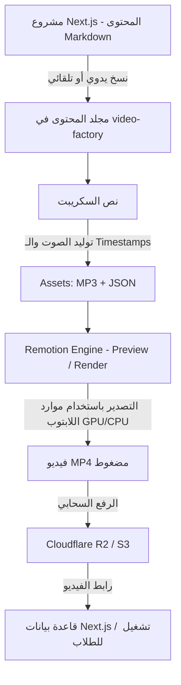
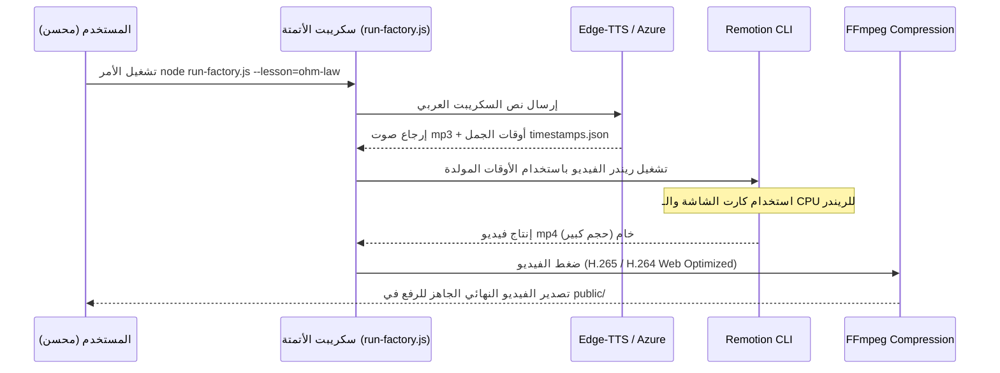

# 🎬 خطة تنفيذ مصنع الفيديوهات المحلي (Local Video Factory) باستخدام Remotion

توضح هذه الخطة كيفية إعداد وتطوير نظام توليد فيديوهات تعليمية ديناميكية باستخدام **Remotion** وتشغيله محلياً بالكامل على جهاز اللابتوب الخاص بك للاستفادة من كامل قدراته الرسومية والحسابية، مع إبقائه منفصلاً تماماً عن الاستضافة (Hosting) لتجنب استهلاك مواردها الضعيفة.

---

## 🧭 نظرة عامة على الهيكل والترابط

يعمل هذا النظام بشكل مستقل كلياً عن مشروع Next.js الأساسي، حيث يتم نقل البيانات والصوتيات محلياً، ثم رفع الفيديو النهائي إلى سحابة التخزين (Cloudflare R2) ليقوم مشروع Next.js بعرضه مباشرة للطلاب.



---

## 💻 1. إعداد البيئة المحلية وتحسين استخدام موارد اللابتوب

لتوليد الفيديوهات بأقصى كفاءة وبدون حدوث تجمد (Freezing) لنظام التشغيل، يجب ضبط موارد الجهاز كالتالي:

### أ. المتطلبات البرمجية الأساسية
1. **Node.js (v18+)**: لتشغيل وتطوير بيئة React الخاصة بـ Remotion.
2. **FFmpeg**: الأداة الأساسية لدمج مسارات الصوت والفيديو وضغطها.
   - **تثبيت ويندوز**: يمكنك تثبيته باستخدام Chocolatey: `choco install ffmpeg` أو تحميله يدوياً وإضافته لمتغيرات البيئة `PATH`.
3. **أداة سحب الصوت (Edge-TTS)**: كبديل مجاني وقوي لـ Azure TTS، يمكن استخدام مكتبة Python تسمى `edge-tts` لتوليد أصوات عربية طبيعية (مثل صوت `ar-EG-SalmaNeural` أو `ar-EG-ShakirNeural`) بدون الحاجة لحساب مدفوع.

### ب. تحسين الأداء على اللابتوب (Performance Tuning)
توليد الفيديوهات يعتمد على تشغيل متصفح Chrome في الخلفية (Headless Chrome) لالتقاط الإطارات إطاراً بإطار (Frame by Frame) ثم تجميعها باستخدام FFmpeg. هذا يستهلك الذاكرة (RAM) والمعالج (CPU).

*   **تحديد عدد الأنوية المستهلكة (Concurrency Control)**:
    افتراضياً، يستخدم Remotion كافة أنوية المعالج، مما قد يؤدي لتوقف اللابتوب عن الاستجابة. يجب تحديد عدد العمليات المتوازية بناءً على حجم الرام:
    *   **RAM 8GB**: استخدم `--concurrency=2` (عمليتين متوازيتين فقط لمنع انهيار الذاكرة).
    *   **RAM 16GB**: استخدم `--concurrency=4` أو `6` (حسب المعالج).
    *   **RAM 32GB**: يمكنك تركها افتراضية أو استخدام `--concurrency=8`.
*   **تسريع كارت الشاشة (GPU Acceleration)**:
    تأكد من تفعيل تسريع كارت الشاشة لـ Puppeteer لتسريع الـ WebGL وحركات الـ Canvas في الـ Simulator. يتم ذلك بإضافة إعدادات في ملف `remotion.config.ts`:
    ```typescript
    import { Config } from "@remotion/cli/config";
    Config.setChromiumOptions({
      gl: "angle", // يسرع معالجة الرسوميات على ويندوز
      ignoreCertificateErrors: true,
    });
    ```
*   **تخزين مؤقت على SSD**:
    تأكد من وضع مجلد `video-factory` على قرص SSD وليس HDD، لأن Remotion يكتب آلاف الصور المؤقتة أثناء التصدير والسرعة هنا تصنع فارقاً ضخماً.

---

## 🏗️ 2. هيكل المجلدات المستقل (video-factory)

قم بإنشاء هذا المجلد في مسار منفصل بجوار مشروعك الحالي (مثلاً: `d:/My WebStie Applications/.../Smaet_Education/video-factory`).

```
📁 video-factory/
├── 📁 .remotion/             # ملفات التخزين المؤقت لـ Remotion
├── 📁 src/
│   ├── 📁 components/        # العناصر التعليمية السينمائية
│   │   ├── MindMapCinematic.tsx
│   │   ├── InfographicCinematic.tsx
│   │   ├── SimulatorCinematic.tsx
│   │   ├── FormulaWrite.tsx
│   │   └── QuizCinematic.tsx
│   ├── 📁 compositions/      # القوالب الأساسية وتجميع المشاهد
│   │   ├── LessonVideo.tsx
│   │   └── MainRoot.tsx      # ملف التسجيل لـ Compositions
│   ├── 📁 data/              # نصوص وبيانات الدروس المستخرجة
│   │   └── ohm-law.json
│   └── 📁 assets/            # الوسائط المحلية
│       ├── 📁 voiceovers/     # ملفات الـ MP3 المولدة لكل درس
│       ├── 📁 timestamps/     # ملفات الـ JSON لمزامنة الكلام
│       ├── 📁 backgrounds/    # صور شبكية وتأثيرات بصرية
│       └── 📁 audio/          # المؤثرات الصوتية والموسيقى الخلفية
├── 📁 public/                # الفيديوهات النهائية المصدرة
├── 📄 remotion.config.ts      # إعدادات ريندر الفيديو والجودة
├── 📄 package.json
└── 📄 run-factory.js          # سكريبت أتمتة العملية بالكامل
```

---

## 🔄 3. سير العمل العملي خطوة بخطوة (Workflow)



### الخطوة 1: تحضير محتوى الدرس (المادة الخام)
يتم حفظ بيانات الدرس بصيغة JSON داخل مجلد `src/data/` كالتالي:
**الملف: `src/data/ohm-law.json`**
```json
{
  "title": "قانون أوم وتطبيقاته",
  "topic": "الفيزياء الكهربية - تالتة ثانوي",
  "voiceoverText": "أهلاً بيكم في درس جديد. النهاردة هنتكلم عن قانون أوم. القانون ده بيفسر العلاقة بين الجهد والتيار والمقاومة.",
  "durationInSeconds": 30, 
  "simulation": {
    "voltageStart": 9,
    "voltageEnd": 12,
    "resistance": 3
  }
}
```

### الخطوة 2: أتمتة توليد الصوت والـ Timestamps
بدلاً من توليد الصوت يدوياً، نستخدم سكريبت بايثون أو نود بسيط مدمج مع `edge-tts` لتوليد ملف الـ MP3، وملف `timestamps.json` الذي يحتوي على توقيت كل كلمة لتغذية الـ Remotion بها.

**مثال لملف المزامنة الناتج `assets/timestamps/ohm-law.json`:**
```json
[
  { "word": "أهلاً", "start": 0.1, "end": 0.5 },
  { "word": "بيكم", "start": 0.5, "end": 0.9 },
  { "word": "في", "start": 0.9, "end": 1.1 },
  { "word": "درس", "start": 1.1, "end": 1.5 }
]
```

### الخطوة 3: برمجة المكونات ومزامنتها في Remotion
في Remotion، نستخدم الـ `frame` الحالي للتحكم بالأنيميشن بناءً على التوقيت الصوتي.
**كود توضيحي للمزامنة (في `src/components/FormulaWrite.tsx`):**
```typescript
import { useCurrentFrame, useVideoConfig } from "remotion";
import audioTimestamps from "../assets/timestamps/ohm-law.json";

export const FormulaWrite: React.FC = () => {
  const frame = useCurrentFrame();
  const { fps } = useVideoConfig();
  const currentTime = frame / fps; // تحويل الفريم لثواني

  // إظهار الكلمات تدريجياً بناءً على التوقيت الفعلي للصوت
  return (
    <div style={{ fontSize: 40, fontFamily: "Cairo", color: "white" }}>
      {audioTimestamps.map((item, index) => {
        const isVisible = currentTime >= item.start;
        return (
          <span 
            key={index} 
            style={{ 
              opacity: isVisible ? 1 : 0, 
              transition: "opacity 0.2s ease-in-out",
              marginRight: "8px"
            }}
          >
            {item.word}
          </span>
        );
      })}
    </div>
  );
};
```

### الخطوة 4: التصدير والضغط التلقائي (Render & Compress)
عند كتابة الأمر التالي في سطر الأوامر على اللابتوب:
```bash
npx remotion render LessonVideo public/ohm-law-raw.mp4 --concurrency=4
```
يصدر فيديو بجودة فائقة لكن بحجم كبير. نستخدم سكريبت FFmpeg مدمج لضغطه ليكون جاهزاً للويب:
```bash
ffmpeg -i public/ohm-law-raw.mp4 -vcodec libx264 -crf 23 -preset medium -acodec aac public/ohm-law-optimized.mp4
```

---

## 🛠️ 4. كود سكريبت الأتمتة الكامل للتشغيل (`run-factory.js`)

هذا السكريبت تقوم بتشغيله على اللابتوب ليقوم بكل الخطوات: قراءة المحتوى، تشغيل الريندر، ضغط الفيديو بالكامل بضغطة زر واحدة.

**الملف: `run-factory.js`**
```javascript
const { execSync } = require("child_process");
const fs = require("fs");
const path = require("path");

// اسم الدرس المطلوب معالجته
const lessonName = process.argv[2] || "ohm-law";
console.log(`🚀 بدء معالجة درس: ${lessonName}...`);

const rawVideoPath = path.join(__dirname, `public/${lessonName}-raw.mp4`);
const finalVideoPath = path.join(__dirname, `public/${lessonName}.mp4`);

try {
  // 1. توليد الريندر من Remotion
  console.log("🎬 جاري ريندر الفيديو باستخدام Remotion...");
  // --concurrency=4 لمنع استهلاك الرام بالكامل والجماد
  execSync(
    `npx remotion render LessonVideo ${rawVideoPath} --props=src/data/${lessonName}.json --concurrency=4`,
    { stdio: "inherit" }
  );

  // 2. ضغط الفيديو باستخدام FFmpeg لتقليل الحجم وتحسين البث على الويب
  console.log("🗜️ جاري ضغط الفيديو باستخدام FFmpeg...");
  if (fs.existsSync(finalVideoPath)) {
    fs.unlinkSync(finalVideoPath);
  }
  execSync(
    `ffmpeg -i ${rawVideoPath} -vcodec libx264 -crf 22 -preset fast -pix_fmt yuv420p -acodec aac -b:a 128k ${finalVideoPath}`,
    { stdio: "inherit" }
  );

  // 3. مسح الملف الضخم الخام
  console.log("🧹 تنظيف الملفات المؤقتة...");
  fs.unlinkSync(rawVideoPath);

  console.log(`✅ تم الانتهاء بنجاح! الفيديو جاهز في: ${finalVideoPath}`);
} catch (error) {
  console.error("❌ حدث خطأ أثناء المعالجة:", error.message);
}
```

---

## ☁️ 5. كيف يتم الربط مع منصة الويب الأساسية (Next.js)؟

بما أن الفيديو يتم إنتاجه على اللابتوب، فكيف يعرض في الموقع الأساسي المرفوع على الاستضافة الضعيفة؟

1. **الرفع السحابي**: تقوم برفع الفيديو الناتج من مجلد `public/` إلى خدمة تخزين سحابي مثل **Cloudflare R2** (تكلفتها منخفضة جداً ونقل البيانات مجاني).
2. **رابط الفيديو**: تأخذ الرابط العام للملف (مثلاً: `https://cdn.myschool.com/videos/ohm-law.mp4`).
3. **التحديث في قاعدة البيانات / ملف Markdown**:
   تقوم بإضافة الرابط في الحقل الخاص بالفيديو في ملف الدرس بالمنصة:
   ```markdown
   ---
   title: "قانون أوم"
   videoUrl: "https://cdn.myschool.com/videos/ohm-law.mp4"
   ---
   ```
4. **العرض للطلاب**:
   عندما يدخل الطالب لصفحة الدرس في Next.js، يقوم الموقع بعرض الفيديو باستخدام مشغل متصفح عادي `<video>` أو مكتبة مثل `VideoJS` أو `Plyr` لقراءة البث السحابي المباشر.
   *   **الاستضافة الخاصة بك لن تبذل أي مجهود**: المعالج والذاكرة للاستضافة لن يتأثرا مطلقاً لأن الفيديو يتم تشغيله مباشرة من متصفح الطالب عبر سحابة R2.

---

## 🚦 6. خطة البدء الفورية اليوم

1. [x] قم بإنشاء مجلد مستقل باسم `video-factory` على اللابتوب.
2. [x] افتح منفذ الأوامر فيه ونفذ أمر إنشاء مشروع Remotion:
    ```bash
    npx create-video@latest
    ```
3. [x] ثبت برنامج FFmpeg وتأكد من عمله عبر كتابة `ffmpeg -version`.
4. [x] انسخ ملف الإعداد `remotion.config.ts` ومكوناتك الرسومية إلى المجلد الجديد.
5. [x] ابدأ بتجربة ريندر فيديو قصير (10 ثوانٍ) وتأكد من عمل سكريبت الضغط والتشغيل بشكل مستقر على مواصفات لابتوبك الحالي.

## ✅ 7. المهام المنجزة والخطوات القادمة

### ما تم إنجازه:
- ✅ تم إنشاء جميع المكونات الرسومية الأساسية (FormulaWrite, SimulatorCinematic, MindMapCinematic, QuizCinematic, InfographicCinematic)
- ✅ تم إعداد سكريبت TTS باستخدام Python + Edge-TTS لتوليد الصوت والتوقيت
- ✅ تم إنشاء سكريبت الأتمتة الكامل `run-factory.js`
- ✅ تم ضبط إعدادات الأداء (Concurrency, GPU Acceleration)
- ✅ تم اختبار النظام وإنتاج فيديو تجريبي

### الخطوات القادمة:
- [ ] تشغيل اختبار كامل: `node run-factory.js --lesson=ohm-law`
- [ ] دمج مكون InfographicCinematic في سير العمل حسب الحاجة
- [ ] رفع الفيديو الناتج إلى Cloudflare R2
- [ ] إنشاء قوالب إضافية للدروس الأخرى
